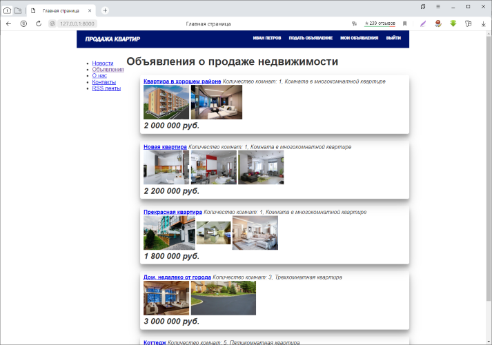

Проект сайта объявлений о продаже недвижимости
==============================================

Основные возможности
--------------------

* Просмотр актуальных объявлений списком или по одному
* Регистрация, авторизация и профиль пользователя
* Зарегистрированный пользователь может подать объявление, редактировать, удалить его или приостановить публикацию.
* К объявлению можно прикрепить несколько фотографий
* Страница с новостями
* RSS каналы для новостей и новых объявлений

 


Инструкция по установке и первому запуску 
-----------------------------------------
Скопировать проект
```commandline
git clone https://github.com/Denis2603/realty-django
```

Установить зависимости:

```bash
pip install -r requirements.txt
```

Провести миграцию:

```bash
python manage.py makemigrations
python manage.py migrate
```

Загрузить данные:

```bash
python manage.py loaddata type rooms
```
*Эта команда загрузит в базу данных предварительно заполненные данные по типу жилья и количеству комнат.*

Создать администратора:

```bash
python manage.py createsuperuser
```

Запустить веб-сервер проекта:

```bash
python manage.py runserver
```

Работа с сайтом
---------------

### Регистрация пользователя
* Нажать на ссылку зарегистрироваться в правом верхнем углу проекта.
* Ввести логин пользователя, пароль, подтверждение пароля  

*После успешной регистрации откроется страница профиля, на которой можно будет указать ФИО, контактные данные, загрузить фото.*

### Возможности зарегистрированного пользователя

#### Редактирование профиля
Нажать на свое имя (или логин) в верхнем меню сайта.

#### Подать объявление
Ссылка "подать объявление" в верхнем меню сайта

#### Просмотр своих объявлений
Ссылка "мои объявления" в верхнем меню сайта
В этом разделе можно посмотреть все свои объявления, отредактировать или удалить их, удалить/добавить фотографии, временно снять объявление с публикации.

#### Выход из системы
Ссылка "выход" в верхнем меню сайта

### RSS каналы
[Список реализованных RSS каналов.](http://127.0.0.1:8000/rss/channels) 

* Новости сайта
* Новые объявления

### Возможности администратора

Создать администратора:

```bash
python manage.py createsuperuser
```
Для администрирования сайта нужно перейти по адресу:  
[http://127.0.0.1:8000/admin/](http://127.0.0.1:8000/admin/)

Административный раздел сайта дает возможность полностью управлять пользователями, поданными объявлениями, редактировать типы жилья и др.

#### Публикация новостей

1. Перейти по адресу [http://127.0.0.1:8000/admin/app_news/news/](http://127.0.0.1:8000/admin/app_news/news/) 
2. Нажать кнопку "Добавить новость +"
3. Ввести заголовок и текст новости и желаемую дату.   
*Если указана дата, которая еще не наступила, то новость не будт опубликована. После наступления указанной даты новость появится на сайте и в RSS канале.*

### Разработчику

Вывод списка объявлений реализован в представлении классе

```python
# app_realty/views.py
class HouseList(generic.ListView):

    queryset = House.objects.filter(actual=True).select_related('rooms').prefetch_related('foto')
    template_name = 'app_realty/main.html'
```

Код приложения покрыт тестами. Реализованы тесты для всех моделей, форм и представлений.  
При внесении изменений в код рекомендуется добавить тест для нового функционала и запустить тестирование следующей командой:  
```commandline
python manage.py test
```
